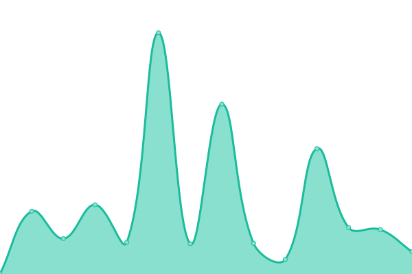
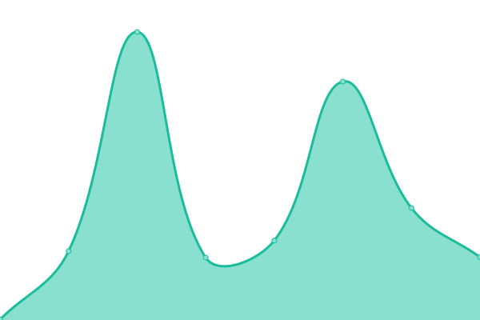

# [📈 Live Status](https://status.esmailelbob.xyz): <!--live status--> **🟧 Partial outage**

This repository contains the open-source uptime monitor and status page for [Esmail EL BoB](https://esmailelbob.xyz), powered by [Upptime](https://github.com/upptime/upptime).

With [Upptime](https://upptime.js.org), you can get your own unlimited and free uptime monitor and status page, powered entirely by a GitHub repository. We use [Issues](https://github.com/EsmailELBoBDev2/upptime/issues) as incident reports, [Actions](https://github.com/EsmailELBoBDev2/upptime/actions) as uptime monitors, and [Pages](https://status.esmailelbob.xyz) for the status page.

<!--start: status pages-->
<!-- This summary is generated by Upptime (https://github.com/upptime/upptime) -->
<!-- Do not edit this manually, your changes will be overwritten -->
<!-- prettier-ignore -->
| URL | Status | History | Response Time | Uptime |
| --- | ------ | ------- | ------------- | ------ |
|  [Main site - https://esmailelbob.xyz](https://esmailelbob.xyz) | 🟩 Up | [main-site-https-esmailelbob-xyz.yml](https://github.com/EsmailELBoBDev2/upptime/commits/HEAD/history/main-site-https-esmailelbob-xyz.yml) | 

 750ms
     
 | 

<a href="https://status.esmailelbob.xyz/history/main-site-https-esmailelbob-xyz">100.00%</a>
    

|  [Bibliogram - https://bibliogram.esmailelbob.xyz](https://bibliogram.esmailelbob.xyz) | 🟩 Up | [bibliogram-https-bibliogram-esmailelbob-xyz.yml](https://github.com/EsmailELBoBDev2/upptime/commits/HEAD/history/bibliogram-https-bibliogram-esmailelbob-xyz.yml) | 

 259ms
     
 | 

<a href="https://status.esmailelbob.xyz/history/bibliogram-https-bibliogram-esmailelbob-xyz">100.00%</a>
    

|  [Libreddit - https://libreddit.esmailelbob.xyz](https://libreddit.esmailelbob.xyz) | 🟩 Up | [libreddit-https-libreddit-esmailelbob-xyz.yml](https://github.com/EsmailELBoBDev2/upptime/commits/HEAD/history/libreddit-https-libreddit-esmailelbob-xyz.yml) | 

 602ms
     
 | 

<a href="https://status.esmailelbob.xyz/history/libreddit-https-libreddit-esmailelbob-xyz">96.99%</a>
    

|  [Invidious - https://invidious.esmailelbob.xyz](https://invidious.esmailelbob.xyz) | 🟥 Down | [invidious-https-invidious-esmailelbob-xyz.yml](https://github.com/EsmailELBoBDev2/upptime/commits/HEAD/history/invidious-https-invidious-esmailelbob-xyz.yml) | 

 427ms
     
 | 

<a href="https://status.esmailelbob.xyz/history/invidious-https-invidious-esmailelbob-xyz">98.88%</a>
    

|  [RSS-Bridge - https://rss-bridge.esmailelbob.xyz](https://rss-bridge.esmailelbob.xyz) | 🟩 Up | [rss-bridge-https-rss-bridge-esmailelbob-xyz.yml](https://github.com/EsmailELBoBDev2/upptime/commits/HEAD/history/rss-bridge-https-rss-bridge-esmailelbob-xyz.yml) | 

 612ms
     
 | 

<a href="https://status.esmailelbob.xyz/history/rss-bridge-https-rss-bridge-esmailelbob-xyz">100.00%</a>
    

|  [Searx - https://searx.esmailelbob.xyz](https://searx.esmailelbob.xyz) | 🟩 Up | [searx-https-searx-esmailelbob-xyz.yml](https://github.com/EsmailELBoBDev2/upptime/commits/HEAD/history/searx-https-searx-esmailelbob-xyz.yml) | 

 341ms
     
 | 

<a href="https://status.esmailelbob.xyz/history/searx-https-searx-esmailelbob-xyz">100.00%</a>
    

|  [Nitter - https://nitter.esmailelbob.xyz](https://nitter.esmailelbob.xyz) | 🟩 Up | [nitter-https-nitter-esmailelbob-xyz.yml](https://github.com/EsmailELBoBDev2/upptime/commits/HEAD/history/nitter-https-nitter-esmailelbob-xyz.yml) | 

 493ms
     
 | 

<a href="https://status.esmailelbob.xyz/history/nitter-https-nitter-esmailelbob-xyz">100.00%</a>
    

|  [Lingva - https://lingva.esmailelbob.xyz](https://lingva.esmailelbob.xyz) | 🟩 Up | [lingva-https-lingva-esmailelbob-xyz.yml](https://github.com/EsmailELBoBDev2/upptime/commits/HEAD/history/lingva-https-lingva-esmailelbob-xyz.yml) | 

 517ms
     
 | 

<a href="https://status.esmailelbob.xyz/history/lingva-https-lingva-esmailelbob-xyz">100.00%</a>
    

|  [Whoogle - https://whoogle.esmailelbob.xyz](http://whoogle.esmailelbob.xyz/home) | 🟥 Down | [whoogle-https-whoogle-esmailelbob-xyz.yml](https://github.com/EsmailELBoBDev2/upptime/commits/HEAD/history/whoogle-https-whoogle-esmailelbob-xyz.yml) | 

 0ms
     
 | 

<a href="https://status.esmailelbob.xyz/history/whoogle-https-whoogle-esmailelbob-xyz">100.00%</a>
    

|  [Libre Translate - https://libretranslate.esmailelbob.xyz](https://libretranslate.esmailelbob.xyz) | 🟩 Up | [libre-translate-https-libretranslate-esmailelbob-xyz.yml](https://github.com/EsmailELBoBDev2/upptime/commits/HEAD/history/libre-translate-https-libretranslate-esmailelbob-xyz.yml) | 

 323ms
     
 | 

<a href="https://status.esmailelbob.xyz/history/libre-translate-https-libretranslate-esmailelbob-xyz">100.00%</a>
    

|  [rimgo - https://rimgo.esmailelbob.xyz](https://rimgo.esmailelbob.xyz) | 🟩 Up | [rimgo-https-rimgo-esmailelbob-xyz.yml](https://github.com/EsmailELBoBDev2/upptime/commits/HEAD/history/rimgo-https-rimgo-esmailelbob-xyz.yml) | 

 314ms
     
 | 

<a href="https://status.esmailelbob.xyz/history/rimgo-https-rimgo-esmailelbob-xyz">100.00%</a>
    

|  [Scribe - https://scribe.esmailelbob.xyz/](https://scribe.esmailelbob.xyz/) | 🟩 Up | [scribe-https-scribe-esmailelbob-xyz.yml](https://github.com/EsmailELBoBDev2/upptime/commits/HEAD/history/scribe-https-scribe-esmailelbob-xyz.yml) | 

 246ms
     
 | 

<a href="https://status.esmailelbob.xyz/history/scribe-https-scribe-esmailelbob-xyz">100.00%</a>
    

|  [WriteFreely - https://blog.esmailelbob.xyz](https://blog.esmailelbob.xyz) | 🟩 Up | [write-freely-https-blog-esmailelbob-xyz.yml](https://github.com/EsmailELBoBDev2/upptime/commits/HEAD/history/write-freely-https-blog-esmailelbob-xyz.yml) | 

 455ms
     
 | 

<a href="https://status.esmailelbob.xyz/history/write-freely-https-blog-esmailelbob-xyz">100.00%</a>
    

|  [Gitea - https://git.esmailelbob.xyz](https://git.esmailelbob.xyz) | 🟩 Up | [gitea-https-git-esmailelbob-xyz.yml](https://github.com/EsmailELBoBDev2/upptime/commits/HEAD/history/gitea-https-git-esmailelbob-xyz.yml) | 

 321ms
     
 | 

<a href="https://status.esmailelbob.xyz/history/gitea-https-git-esmailelbob-xyz">100.00%</a>
    

|  [Librarian - https://librarian.esmailelbob.xyz](https://librarian.esmailelbob.xyz) | 🟩 Up | [librarian-https-librarian-esmailelbob-xyz.yml](https://github.com/EsmailELBoBDev2/upptime/commits/HEAD/history/librarian-https-librarian-esmailelbob-xyz.yml) | 

 415ms
     
 | 

<a href="https://status.esmailelbob.xyz/history/librarian-https-librarian-esmailelbob-xyz">100.00%</a>
    

|  [Reddit Top RSS - https://rss-reddit.esmailelbob.xyz/](https://rss-reddit.esmailelbob.xyz/?subreddit=memes) | 🟩 Up | [reddit-top-rss-https-rss-reddit-esmailelbob-xyz.yml](https://github.com/EsmailELBoBDev2/upptime/commits/HEAD/history/reddit-top-rss-https-rss-reddit-esmailelbob-xyz.yml) | 

 226ms
     
 | 

<a href="https://status.esmailelbob.xyz/history/reddit-top-rss-https-rss-reddit-esmailelbob-xyz">100.00%</a>
    

|  [ProxiTok - https://proxitok.esmailelbob.xyz/](https://proxitok.esmailelbob.xyz/) | 🟩 Up | [proxi-tok-https-proxitok-esmailelbob-xyz.yml](https://github.com/EsmailELBoBDev2/upptime/commits/HEAD/history/proxi-tok-https-proxitok-esmailelbob-xyz.yml) | 

 248ms
     
 | 

<a href="https://status.esmailelbob.xyz/history/proxi-tok-https-proxitok-esmailelbob-xyz">100.00%</a>
    

|  Pixelfed | 🟩 Up | [pixelfed.yml](https://github.com/EsmailELBoBDev2/upptime/commits/HEAD/history/pixelfed.yml) | 

 356ms
     
 | 

<a href="https://status.esmailelbob.xyz/history/pixelfed">100.00%</a>
    

|  Nextcloud | 🟩 Up | [nextcloud.yml](https://github.com/EsmailELBoBDev2/upptime/commits/HEAD/history/nextcloud.yml) | 

 774ms
     
 | 

<a href="https://status.esmailelbob.xyz/history/nextcloud">100.00%</a>
    

|  Snikket | 🟩 Up | [snikket.yml](https://github.com/EsmailELBoBDev2/upptime/commits/HEAD/history/snikket.yml) | 

 223ms
     
 | 

<a href="https://status.esmailelbob.xyz/history/snikket">98.18%</a>
    

|  [Mastodon - https://social.esmailelbob.xyz/](https://social.esmailelbob.xyz/@esmail) | 🟩 Up | [mastodon-https-social-esmailelbob-xyz.yml](https://github.com/EsmailELBoBDev2/upptime/commits/HEAD/history/mastodon-https-social-esmailelbob-xyz.yml) | 

 671ms
     
 | 

<a href="https://status.esmailelbob.xyz/history/mastodon-https-social-esmailelbob-xyz">100.00%</a>
    

|  MailCow | 🟩 Up | [mail-cow.yml](https://github.com/EsmailELBoBDev2/upptime/commits/HEAD/history/mail-cow.yml) | 

 300ms
     
 | 

<a href="https://status.esmailelbob.xyz/history/mail-cow">100.00%</a>
    

|  Pi-Hole | 🟩 Up | [pi-hole.yml](https://github.com/EsmailELBoBDev2/upptime/commits/HEAD/history/pi-hole.yml) | 

 191ms
     
 | 

<a href="https://status.esmailelbob.xyz/history/pi-hole">100.00%</a>
    

|  Pastefy | 🟩 Up | [pastefy.yml](https://github.com/EsmailELBoBDev2/upptime/commits/HEAD/history/pastefy.yml) | 

 224ms
     
 | 

<a href="https://status.esmailelbob.xyz/history/pastefy">100.00%</a>
    

<!--end: status pages-->

[**Visit our status website →**](https://status.esmailelbob.xyz)

## 📄 License

- Powered by: [Upptime](https://github.com/upptime/upptime)
- Code: [MIT](./LICENSE) © [Esmail EL BoB](https://esmailelbob.xyz)
- Data in the `./history` directory: [Open Database License](https://opendatacommons.org/licenses/odbl/1-0/)
