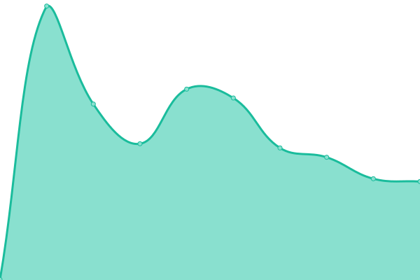
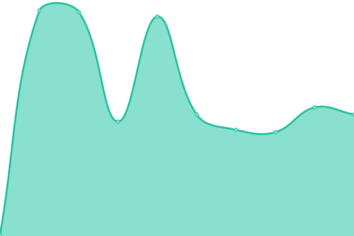
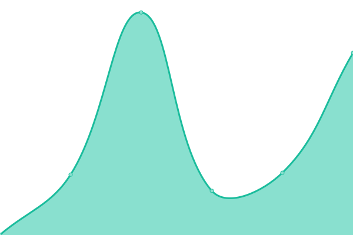
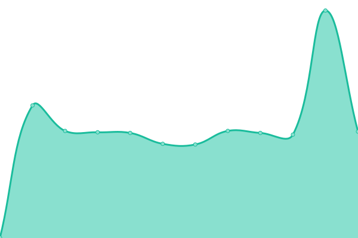
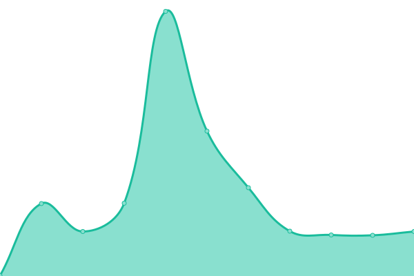
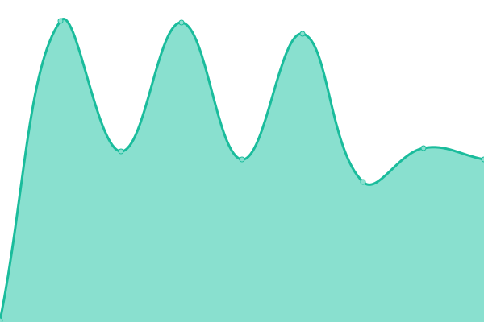

# [📈 Live Status](https://status.esmailelbob.xyz): <!--live status--> **🟩 All systems operational**

This repository contains the open-source uptime monitor and status page for [Esmail EL BoB](https://esmailelbob.xyz), powered by [Upptime](https://github.com/upptime/upptime).

With [Upptime](https://upptime.js.org), you can get your own unlimited and free uptime monitor and status page, powered entirely by a GitHub repository. We use [Issues](https://github.com/EsmailELBoBDev2/upptime/issues) as incident reports, [Actions](https://github.com/EsmailELBoBDev2/upptime/actions) as uptime monitors, and [Pages](https://status.esmailelbob.xyz) for the status page.

<!--start: status pages-->
<!-- This summary is generated by Upptime (https://github.com/upptime/upptime) -->
<!-- Do not edit this manually, your changes will be overwritten -->
<!-- prettier-ignore -->
| URL | Status | History | Response Time | Uptime |
| --- | ------ | ------- | ------------- | ------ |
|  [Main site](https://esmailelbob.xyz) | 🟩 Up | [main-site.yml](https://github.com/EsmailELBoBDev2/upptime/commits/HEAD/history/main-site.yml) | 

 398ms
     
 | 

<a href="https://EsmailELBoBDev2.github.io/upptime/history/main-site">100.00%</a>
    

|  [Bibliogram](https://bibliogram.esmailelbob.xyz) | 🟩 Up | [bibliogram.yml](https://github.com/EsmailELBoBDev2/upptime/commits/HEAD/history/bibliogram.yml) | 

 122ms
     
 | 

<a href="https://EsmailELBoBDev2.github.io/upptime/history/bibliogram">100.00%</a>
    

|  [Libreddit](https://libreddit.esmailelbob.xyz) | 🟩 Up | [libreddit.yml](https://github.com/EsmailELBoBDev2/upptime/commits/HEAD/history/libreddit.yml) | 

 605ms
     
 | 

<a href="https://EsmailELBoBDev2.github.io/upptime/history/libreddit">100.00%</a>
    

|  [Invidious](https://invidious.esmailelbob.xyz) | 🟩 Up | [invidious.yml](https://github.com/EsmailELBoBDev2/upptime/commits/HEAD/history/invidious.yml) | 

 262ms
     
 | 

<a href="https://EsmailELBoBDev2.github.io/upptime/history/invidious">98.53%</a>
    

|  [RSS-Bridge](https://rss-bridge.esmailelbob.xyz) | 🟩 Up | [rss-bridge.yml](https://github.com/EsmailELBoBDev2/upptime/commits/HEAD/history/rss-bridge.yml) | 

 344ms
     
 | 

<a href="https://EsmailELBoBDev2.github.io/upptime/history/rss-bridge">100.00%</a>
    

|  [Searx](https://searx.esmailelbob.xyz) | 🟩 Up | [searx.yml](https://github.com/EsmailELBoBDev2/upptime/commits/HEAD/history/searx.yml) | 

 238ms
     
 | 

<a href="https://EsmailELBoBDev2.github.io/upptime/history/searx">100.00%</a>
    

|  [Nitter](https://nitter.esmailelbob.xyz) | 🟩 Up | [nitter.yml](https://github.com/EsmailELBoBDev2/upptime/commits/HEAD/history/nitter.yml) | 

 124ms
     
 | 

<a href="https://EsmailELBoBDev2.github.io/upptime/history/nitter">100.00%</a>
    

|  WriteFreely | 🟩 Up | [write-freely.yml](https://github.com/EsmailELBoBDev2/upptime/commits/HEAD/history/write-freely.yml) | 

 196ms
     
 | 

<a href="https://EsmailELBoBDev2.github.io/upptime/history/write-freely">100.00%</a>
    

|  Pixelfed | 🟩 Up | [pixelfed.yml](https://github.com/EsmailELBoBDev2/upptime/commits/HEAD/history/pixelfed.yml) | 

 253ms
     
 | 

<a href="https://EsmailELBoBDev2.github.io/upptime/history/pixelfed">99.19%</a>
    

|  Nextcloud | 🟩 Up | [nextcloud.yml](https://github.com/EsmailELBoBDev2/upptime/commits/HEAD/history/nextcloud.yml) | 

 647ms
     
 | 

<a href="https://EsmailELBoBDev2.github.io/upptime/history/nextcloud">100.00%</a>
    

|  Snikket | 🟩 Up | [snikket.yml](https://github.com/EsmailELBoBDev2/upptime/commits/HEAD/history/snikket.yml) | 

 168ms
     
 | 

<a href="https://EsmailELBoBDev2.github.io/upptime/history/snikket">98.84%</a>
    

|  Mastodon | 🟩 Up | [mastodon.yml](https://github.com/EsmailELBoBDev2/upptime/commits/HEAD/history/mastodon.yml) | 

 353ms
     
 | 

<a href="https://EsmailELBoBDev2.github.io/upptime/history/mastodon">100.00%</a>
    

|  MailCow | 🟩 Up | [mail-cow.yml](https://github.com/EsmailELBoBDev2/upptime/commits/HEAD/history/mail-cow.yml) | 

 169ms
     
 | 

<a href="https://EsmailELBoBDev2.github.io/upptime/history/mail-cow">100.00%</a>
    

|  Pi-Hole | 🟩 Up | [pi-hole.yml](https://github.com/EsmailELBoBDev2/upptime/commits/HEAD/history/pi-hole.yml) | 

 120ms
     
 | 

<a href="https://EsmailELBoBDev2.github.io/upptime/history/pi-hole">100.00%</a>
    

<!--end: status pages-->

[**Visit our status website →**](https://status.esmailelbob.xyz)

## 📄 License

- Powered by: [Upptime](https://github.com/upptime/upptime)
- Code: [MIT](./LICENSE) © [Esmail EL BoB](https://esmailelbob.xyz)
- Data in the `./history` directory: [Open Database License](https://opendatacommons.org/licenses/odbl/1-0/)
