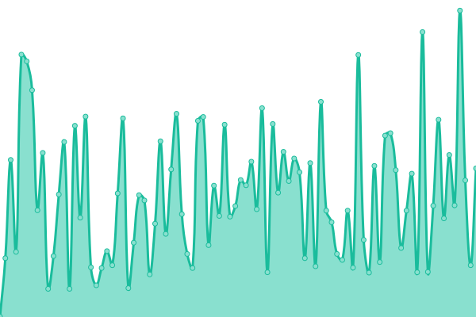
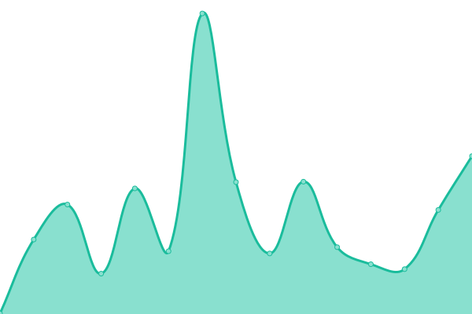

# [📈 Live Status](https://status.esmailelbob.xyz): <!--live status--> **🟧 Partial outage**

This repository contains the open-source uptime monitor and status page for [Esmail EL BoB](https://esmailelbob.xyz), powered by [Upptime](https://github.com/upptime/upptime).

With [Upptime](https://upptime.js.org), you can get your own unlimited and free uptime monitor and status page, powered entirely by a GitHub repository. We use [Issues](https://github.com/EsmailELBoBDev2/upptime/issues) as incident reports, [Actions](https://github.com/EsmailELBoBDev2/upptime/actions) as uptime monitors, and [Pages](https://status.esmailelbob.xyz) for the status page.

<!--start: status pages-->
<!-- This summary is generated by Upptime (https://github.com/upptime/upptime) -->
<!-- Do not edit this manually, your changes will be overwritten -->
<!-- prettier-ignore -->
| URL | Status | History | Response Time | Uptime |
| --- | ------ | ------- | ------------- | ------ |
|  [Main site - esmailelbob.xyz](https://esmailelbob.xyz/) | 🟩 Up | [main-site-esmailelbob-xyz.yml](https://github.com/EsmailELBoBDev2/upptime/commits/HEAD/history/main-site-esmailelbob-xyz.yml) | 

 907ms
     
 | 

<a href="https://status.esmailelbob.xyz/history/main-site-esmailelbob-xyz">100.00%</a>
    

|  [Libreddit - libreddit.esmailelbob.xyz](https://libreddit.esmailelbob.xyz/) | 🟩 Up | [libreddit-libreddit-esmailelbob-xyz.yml](https://github.com/EsmailELBoBDev2/upptime/commits/HEAD/history/libreddit-libreddit-esmailelbob-xyz.yml) | 

 4756ms
     
 | 

<a href="https://status.esmailelbob.xyz/history/libreddit-libreddit-esmailelbob-xyz">100.00%</a>
    

|  [Invidious - invidious.esmailelbob.xyz](https://invidious.esmailelbob.xyz/) | 🟩 Up | [invidious-invidious-esmailelbob-xyz.yml](https://github.com/EsmailELBoBDev2/upptime/commits/HEAD/history/invidious-invidious-esmailelbob-xyz.yml) | 

 561ms
     
 | 

<a href="https://status.esmailelbob.xyz/history/invidious-invidious-esmailelbob-xyz">99.78%</a>
    

|  [Searx - searx.esmailelbob.xyz](https://searx.esmailelbob.xyz/) | 🟩 Up | [searx-searx-esmailelbob-xyz.yml](https://github.com/EsmailELBoBDev2/upptime/commits/HEAD/history/searx-searx-esmailelbob-xyz.yml) | 

 289ms
     
 | 

<a href="https://status.esmailelbob.xyz/history/searx-searx-esmailelbob-xyz">100.00%</a>
    

|  [Nitter - nitter.esmailelbob.xyz](https://nitter.esmailelbob.xyz/) | 🟥 Down | [nitter-nitter-esmailelbob-xyz.yml](https://github.com/EsmailELBoBDev2/upptime/commits/HEAD/history/nitter-nitter-esmailelbob-xyz.yml) | 

 3052ms
     
 | 

<a href="https://status.esmailelbob.xyz/history/nitter-nitter-esmailelbob-xyz">92.67%</a>
    

|  [rimgo - rimgo.esmailelbob.xyz](https://rimgo.esmailelbob.xyz/) | 🟩 Up | [rimgo-rimgo-esmailelbob-xyz.yml](https://github.com/EsmailELBoBDev2/upptime/commits/HEAD/history/rimgo-rimgo-esmailelbob-xyz.yml) | 

 327ms
     
 | 

<a href="https://status.esmailelbob.xyz/history/rimgo-rimgo-esmailelbob-xyz">100.00%</a>
    

|  [Scribe - scribe.esmailelbob.xyz/](https://scribe.esmailelbob.xyz/) | 🟩 Up | [scribe-scribe-esmailelbob-xyz.yml](https://github.com/EsmailELBoBDev2/upptime/commits/HEAD/history/scribe-scribe-esmailelbob-xyz.yml) | 

 264ms
     
 | 

<a href="https://status.esmailelbob.xyz/history/scribe-scribe-esmailelbob-xyz">100.00%</a>
    

|  [WriteFreely - blog.esmailelbob.xyz](https://blog.esmailelbob.xyz/) | 🟩 Up | [write-freely-blog-esmailelbob-xyz.yml](https://github.com/EsmailELBoBDev2/upptime/commits/HEAD/history/write-freely-blog-esmailelbob-xyz.yml) | 

 461ms
     
 | 

<a href="https://status.esmailelbob.xyz/history/write-freely-blog-esmailelbob-xyz">100.00%</a>
    

|  [Gitea - git.esmailelbob.xyz](https://git.esmailelbob.xyz/) | 🟩 Up | [gitea-git-esmailelbob-xyz.yml](https://github.com/EsmailELBoBDev2/upptime/commits/HEAD/history/gitea-git-esmailelbob-xyz.yml) | 

 287ms
     
 | 

<a href="https://status.esmailelbob.xyz/history/gitea-git-esmailelbob-xyz">100.00%</a>
    

|  [Librarian - librarian.esmailelbob.xyz](https://librarian.esmailelbob.xyz/) | 🟩 Up | [librarian-librarian-esmailelbob-xyz.yml](https://github.com/EsmailELBoBDev2/upptime/commits/HEAD/history/librarian-librarian-esmailelbob-xyz.yml) | 

 257ms
     
 | 

<a href="https://status.esmailelbob.xyz/history/librarian-librarian-esmailelbob-xyz">100.00%</a>
    

|  [Reddit Top RSS - rss-reddit.esmailelbob.xyz](https://rss-reddit.esmailelbob.xyz/?subreddit=memes) | 🟩 Up | [reddit-top-rss-rss-reddit-esmailelbob-xyz.yml](https://github.com/EsmailELBoBDev2/upptime/commits/HEAD/history/reddit-top-rss-rss-reddit-esmailelbob-xyz.yml) | 

 270ms
     
 | 

<a href="https://status.esmailelbob.xyz/history/reddit-top-rss-rss-reddit-esmailelbob-xyz">100.00%</a>
    

|  [ProxiTok - proxitok.esmailelbob.xyz](https://proxitok.esmailelbob.xyz/) | 🟩 Up | [proxi-tok-proxitok-esmailelbob-xyz.yml](https://github.com/EsmailELBoBDev2/upptime/commits/HEAD/history/proxi-tok-proxitok-esmailelbob-xyz.yml) | 

 271ms
     
 | 

<a href="https://status.esmailelbob.xyz/history/proxi-tok-proxitok-esmailelbob-xyz">100.00%</a>
    

|  [SimplyTranslate - simplytranslate.esmailelbob.xyz](https://simplytranslate.esmailelbob.xyz/) | 🟩 Up | [simply-translate-simplytranslate-esmailelbob-xyz.yml](https://github.com/EsmailELBoBDev2/upptime/commits/HEAD/history/simply-translate-simplytranslate-esmailelbob-xyz.yml) | 

 337ms
     
 | 

<a href="https://status.esmailelbob.xyz/history/simply-translate-simplytranslate-esmailelbob-xyz">100.00%</a>
    

|  [SimpleerTube - simpleertube.esmailelbob.xyz](https://simpleertube.esmailelbob.xyz/) | 🟩 Up | [simpleer-tube-simpleertube-esmailelbob-xyz.yml](https://github.com/EsmailELBoBDev2/upptime/commits/HEAD/history/simpleer-tube-simpleertube-esmailelbob-xyz.yml) | 

 283ms
     
 | 

<a href="https://status.esmailelbob.xyz/history/simpleer-tube-simpleertube-esmailelbob-xyz">100.00%</a>
    

|  [PornInvidious - porninvidious.esmailelbob.xyz](https://porninvidious.esmailelbob.xyz/) | 🟩 Up | [porn-invidious-porninvidious-esmailelbob-xyz.yml](https://github.com/EsmailELBoBDev2/upptime/commits/HEAD/history/porn-invidious-porninvidious-esmailelbob-xyz.yml) | 

 10018ms
     
 | 

<a href="https://status.esmailelbob.xyz/history/porn-invidious-porninvidious-esmailelbob-xyz">74.99%</a>
    

|  [WikiLess - wikiless.esmailelbob.xyz](https://wikiless.esmailelbob.xyz/) | 🟩 Up | [wiki-less-wikiless-esmailelbob-xyz.yml](https://github.com/EsmailELBoBDev2/upptime/commits/HEAD/history/wiki-less-wikiless-esmailelbob-xyz.yml) | 

 364ms
     
 | 

<a href="https://status.esmailelbob.xyz/history/wiki-less-wikiless-esmailelbob-xyz">99.69%</a>
    

|  [BeatBump - beatbump.esmailelbob.xyz](https://beatbump.esmailelbob.xyz/) | 🟩 Up | [beat-bump-beatbump-esmailelbob-xyz.yml](https://github.com/EsmailELBoBDev2/upptime/commits/HEAD/history/beat-bump-beatbump-esmailelbob-xyz.yml) | 

 3978ms
     
 | 

<a href="https://status.esmailelbob.xyz/history/beat-bump-beatbump-esmailelbob-xyz">100.00%</a>
    

|  [Simplynews - simplynews.esmailelbob.xyz](http://simplynews.esmailelbob.xyz/) | 🟩 Up | [simplynews-simplynews-esmailelbob-xyz.yml](https://github.com/EsmailELBoBDev2/upptime/commits/HEAD/history/simplynews-simplynews-esmailelbob-xyz.yml) | 

 370ms
     
 | 

<a href="https://status.esmailelbob.xyz/history/simplynews-simplynews-esmailelbob-xyz">100.00%</a>
    

|  [Piped - piped.esmailelbob.xyz](http://piped.esmailelbob.xyz/) | 🟩 Up | [piped-piped-esmailelbob-xyz.yml](https://github.com/EsmailELBoBDev2/upptime/commits/HEAD/history/piped-piped-esmailelbob-xyz.yml) | 

 380ms
     
 | 

<a href="https://status.esmailelbob.xyz/history/piped-piped-esmailelbob-xyz">100.00%</a>
    

|  [Minecraft Server - mc.esmailelbob.xyz](mc.esmailelbob.xyz) | 🟥 Down | [minecraft-server-mc-esmailelbob-xyz.yml](https://github.com/EsmailELBoBDev2/upptime/commits/HEAD/history/minecraft-server-mc-esmailelbob-xyz.yml) | 

 0ms
     
 | 

<a href="https://status.esmailelbob.xyz/history/minecraft-server-mc-esmailelbob-xyz">0.00%</a>
    

|  Pixelfed | 🟩 Up | [pixelfed.yml](https://github.com/EsmailELBoBDev2/upptime/commits/HEAD/history/pixelfed.yml) | 

 385ms
     
 | 

<a href="https://status.esmailelbob.xyz/history/pixelfed">100.00%</a>
    

|  Nextcloud | 🟩 Up | [nextcloud.yml](https://github.com/EsmailELBoBDev2/upptime/commits/HEAD/history/nextcloud.yml) | 

 972ms
     
 | 

<a href="https://status.esmailelbob.xyz/history/nextcloud">100.00%</a>
    

|  Snikket | 🟩 Up | [snikket.yml](https://github.com/EsmailELBoBDev2/upptime/commits/HEAD/history/snikket.yml) | 

 282ms
     
 | 

<a href="https://status.esmailelbob.xyz/history/snikket">91.76%</a>
    

|  [Mastodon - https://social.esmailelbob.xyz/](https://social.esmailelbob.xyz/@esmail) | 🟩 Up | [mastodon-https-social-esmailelbob-xyz.yml](https://github.com/EsmailELBoBDev2/upptime/commits/HEAD/history/mastodon-https-social-esmailelbob-xyz.yml) | 

 760ms
     
 | 

<a href="https://status.esmailelbob.xyz/history/mastodon-https-social-esmailelbob-xyz">100.00%</a>
    

|  MailCow | 🟩 Up | [mail-cow.yml](https://github.com/EsmailELBoBDev2/upptime/commits/HEAD/history/mail-cow.yml) | 

 357ms
     
 | 

<a href="https://status.esmailelbob.xyz/history/mail-cow">100.00%</a>
    

|  Pi-Hole | 🟩 Up | [pi-hole.yml](https://github.com/EsmailELBoBDev2/upptime/commits/HEAD/history/pi-hole.yml) | 

 213ms
     
 | 

<a href="https://status.esmailelbob.xyz/history/pi-hole">100.00%</a>
    

|  [Jellyfin - jellyfin.esmailelbob.xyz](https://jellyfin.esmailelbob.xyz/web/index.html) | 🟩 Up | [jellyfin-jellyfin-esmailelbob-xyz.yml](https://github.com/EsmailELBoBDev2/upptime/commits/HEAD/history/jellyfin-jellyfin-esmailelbob-xyz.yml) | 

 491ms
     
 | 

<a href="https://status.esmailelbob.xyz/history/jellyfin-jellyfin-esmailelbob-xyz">100.00%</a>
    

<!--end: status pages-->

[**Visit our status website →**](https://status.esmailelbob.xyz)

## 📄 License

- Powered by: [Upptime](https://github.com/upptime/upptime)
- Code: [MIT](./LICENSE) © [Esmail EL BoB](https://esmailelbob.xyz)
- Data in the `./history` directory: [Open Database License](https://opendatacommons.org/licenses/odbl/1-0/)
